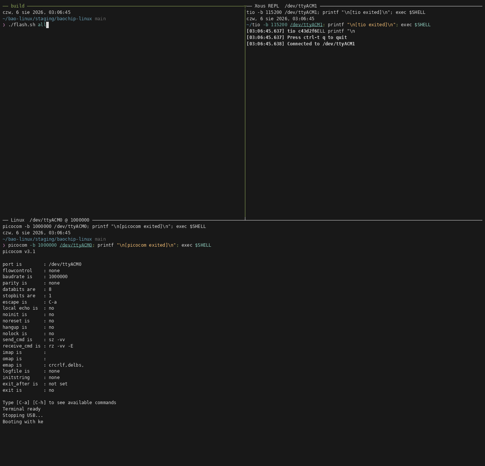

# Running Linux on Baochip-1x



My attempt to boot mainline Linux on a stock [Dabao](https://baochip.com/) board. It works: the kernel executes in place out of RRAM, the whole system lives in 2 MiB of on-chip SRAM, and you get an interactive BusyBox shell over a serial console. It is also *only* that. There are basically no drivers.

## Status

| Subsystem | State |
|---|---|
| XIP kernel from RRAM, Sv32 | yes |
| Serial console | yes - SBI API over UART2 |
| Timer / clocksource / clockevent | yes - TICKTIMER via SBI, 100 kHz |
| Interactive shell, job control | yes - BusyBox as PID 1 |
| Userspace ELF, fork, mmap, /proc | yes |
| Storage of any kind | no |
| Interrupt controller driver | no - the timer IRQ is handled in M-mode |
| UART driver | no - console goes through SBI |
| USB, SDIO, SPI, GPIO, BIO, RRAM MTD | no |
| Networking | no |
| Suspend, power management | no |

## The repos

| Repo | What's in it |
|---|---|
| [`pkoscik/linux`](https://github.com/pkoscik/linux/tree/rv32-xip) (`rv32-xip`) | patches on `v6.19-rc5` that make XIP work on 32-bit RISC-V |
| [`pkoscik/xous-core`](https://github.com/pkoscik/xous-core/tree/linux-mmode-stub) (`linux-mmode-stub`) | the M-mode SBI stub that boots it |

## The board

The [Baochip-1x](https://baochip.com/) is a Rust-first SoC, and the [Dabao](https://www.crowdsupply.com/baochip/dabao) is its evaluation board.
It is designed to run [Xous](https://betrusted.io/xous-book/), a pure-Rust embedded OS, and it is not a Linux target in any sense - which is most of the fun.

| Component | Detail |
|---|---|
| CPU | VexRiscv, RV32IMAC @ 700 MHz, M/S/U privilege, MMU |
| MMU | Sv32 |
| Caches | 16 KiB I + 16 KiB D, write-through |
| RRAM | 4 MiB @ `0x6000_0000` |
| SRAM | 2 MiB @ `0x6100_0000` |
| Package | WLCSP-71 |
| Interrupts | no PLIC; a CSR-mapped array, 20 banks x 16 lines |
| Timer | no CLINT, no `mtime`, `MTIP` tied to zero in the RTL |
| Console | UDMA UART2 on PB13/PB14 |

## Overview

```
boot0 -> boot1 -> M-mode SBI stub -> Linux (S-mode)
 ROM     xous      xous-core          XIP from RRAM
         updater   baremetal app      data in SRAM
```

SBI is emulated. There is no OpenSBI port. The bao1x has no CLINT, no PMP, one hart and no `time` CSR, so nearly everything OpenSBI provides is either absent or unused, and a port would mean stubbing most of it out. Instead there is a small M-mode stub built as a target of the baremetal app, which inherits its linker script, signing and UF2 packaging. It also emulates the missing `time`/`timeh` CSRs, and turns TICKTIMER's alarm into an injected `mip.STIP`, so Linux drives its own stock `timer-riscv` with no kernel patch.

The kernel has to run XIP, it is not an optimisation. Code and rodata are 1463 K against 2048 K of SRAM, before page tables, slab, or a byte of userspace, so a conventional build needs more RAM for its own text than the chip has in total. Executing it out of RRAM leaves 179 K of rwdata and bss in SRAM, and about 650 K free with a shell running.

Which is awkward, because RISC-V XIP was deleted from mainline in [`9b3a2be84803`](https://github.com/torvalds/linux/commit/9b3a2be84803cf18c4b4d1efc695991f0daa153c) on the grounds that it kept breaking and therefore had no users. This is pinned to `v6.19-rc5` and will not follow the tree forward.

## Building

You need `clang`/`lld`, `zig`, `rustup` (`riscv32imac-unknown-none-elf`), `dtc`, `python3`, `cpio` and `curl`.
`./setup.sh check` tells you what is missing and refuses to continue if anything is.

```sh
git clone --recurse-submodules https://github.com/pkoscik/baochip-linux
cd baochip-linux
./setup.sh              # check tools, fetch submodules, write the kernel config

./flash.sh busybox      # bin/busybox-rv32-min, from source
./flash.sh demo         # bin/demo-rv32, from initramfs/demo.c
./flash.sh all          # stub + device tree + kernel, onto the board
```

Userspace has to be built first: the initramfs is compiled into the kernel image.

> [!NOTE]
> The `BAOCHIP` volume only exists in bootloader mode. Hold `BOOT` while plugging USB or rebooting the board, and `flash.sh` will find it. Set `VOL=out` to write the images to a directory instead.

Flashing is just copying UF2 files onto a mass-storage volume - `boot1` programs RRAM as the blocks arrive.

## Booting it

Two consoles. The Xous REPL is on `/dev/ttyACM0` over USB. Linux talks on UART2, which needs a 3.3 V USB-TTL:

| Header pin | Signal | Adapter |
|---|---|---|
| 15 | PB14 / UART2TX | RX |
| 16 | PB13 / UART2RX | TX |
| 13 | GND | GND |

```sh
picocom /dev/ttyACM0              # Xous REPL
picocom -b 1000000 /dev/ttyUSB0   # Linux console
```

```
[    0.000000] Linux version 6.19.0-rc5 (clang version 22.1.8, LLD 22.1.8)
[    0.000000] Machine model: Baochip-1x Dabao
[    0.000000] SBI specification v1.0 detected
[    0.000000] clocksource: riscv_clocksource: mask: 0xffffffffffffffff
[    0.000000] sched_clock: 64 bits at 100kHz, resolution 10000ns
[    0.005470] Memory: 1468K/2040K available (1283K kernel code, 111K rwdata,
                          180K rodata, 150K init, 68K bss, 340K reserved)
[    0.038600] Run /init as init process

=== Linux on Baochip-1x ===
Linux (none) 6.19.0-rc5 riscv32 GNU/Linux
              total        used        free      shared  buff/cache   available
Mem:           1756         792         656           0         308         396
```

`/bin/demo` is a separate statically linked ELF rather than a BusyBox applet, because applets run inside one already-resident binary and prove much less:

```
== this process's memory map ==
00010000-00012000 r--p 00000000 00:02 24         /bin/demo
00012000-0001b000 r-xp 00001000 00:02 24         /bin/demo
0001b000-0001c000 rw-p 00009000 00:02 24         /bin/demo
86355000-86356000 r-xp 00000000 00:00 0          [vdso]
9d0da000-9d0fb000 rw-p 00000000 00:00 0          [stack]

== fork ==
  child:  pid 37, parent 36
  parent: pid 36, child 37 exited with 7

== timer from userspace ==
slept 1s, clock says 1003 ms
```

## Links

- Baochip: <https://baochip.com/> and the [Dabao on Crowd Supply](https://www.crowdsupply.com/baochip/dabao)
- Xous Book: <https://betrusted.io/xous-book/>
- Dabao board files, BOM and pinout: <https://github.com/baochip/dabao>
- Baremetal SDK for the Dabao: <https://github.com/samblenny/baochip-sdk>
- `linux-on-litex-vexriscv`: <https://github.com/litex-hub/linux-on-litex-vexriscv>
- The unfortunate XIP removal: [`9b3a2be84803`](https://github.com/torvalds/linux/commit/9b3a2be84803cf18c4b4d1efc695991f0daa153c)
